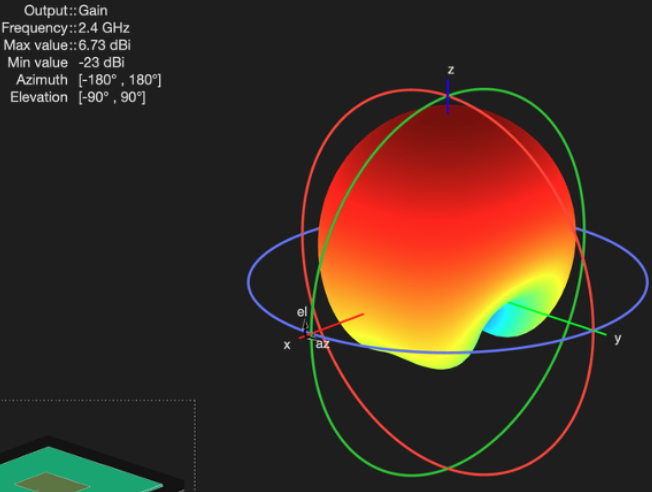
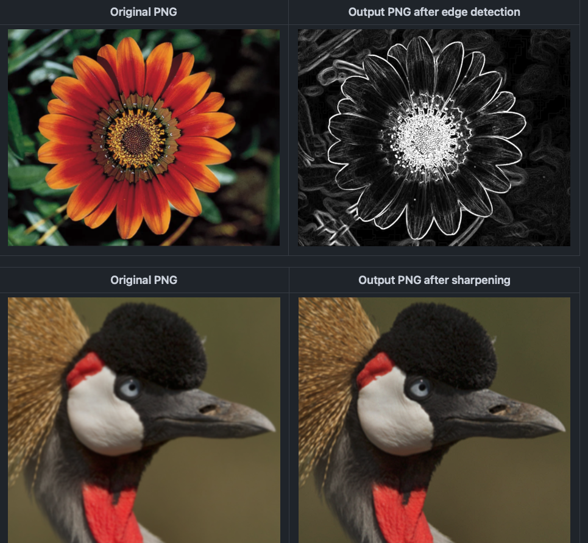
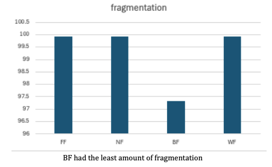
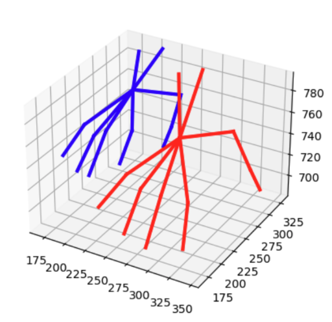

Currently finishing up my bachelor's from [The University of Texas at Arlington](https://www.uta.edu) in Computer Engineering!

## Research

I'm currently involved in projects at the intersection of **signal processing**, **embedded systems**, and **HCI** at the [Hybrid Atelier](https://hybridatelier.uta.edu).

I focus on designing responsive hardware prototypes, developing signal-based interaction systems and user-centered embedded solutions.

## Teaching

I’ve served as a GTA and mentor for the following classes:

[Electronics CSE 3323](https://catalog.uta.edu/search/?P=CSE%203323) — UTA, Spring 2025 
[Intermediate Programming CSE 1320](https://catalog.uta.edu/search/?P=CSE%201320) — UTA, Spring 2024 
[Intermediate Programming CSE 1320](https://catalog.uta.edu/search/?P=CSE%201320) — UTA, Fall 2023 
[Introduction to Programming CSE 1310](https://catalog.uta.edu/search/?P=CSE%201310) — UTA, Spring 2023 

## Projects

Here are a few technical and personal projects I’ve worked on:

  
  

    <h3 style="margin: 0;">
      <a href="https://github.com/marwanthestudent/DigitalRF_Station" style="text-decoration: none; color: inherit;">
        DigitalRF_Station
      </a>
    </h3>
    

      A massive wireless communications project that involved building circuits, embedded programming, designing and printing antennae, signal processing, and much more.
    

  

  
  

    <h3 style="margin: 0;">
      <a href="https://github.com/marwanthestudent/Image_processing_tool" style="text-decoration: none; color: inherit;">
        Image_Processing_Tool
      </a>
    </h3>
    

      An image processing application that does, gaussian blur, sharpening, unsharpening and edge detection on an image.
    

  

  
  

    <h3 style="margin: 0;">
      <a href="https://github.com/marwanthestudent/CustomAlloc" style="text-decoration: none; color: inherit;">
        CustomAlloc
      </a>
    </h3>
    

      An implementation of malloc, calloc, realloc and free in C.
    

  

  
  

    <h3 style="margin: 0;">
      <a href="https://github.com/marwanthestudent/Handpose_Estimation" style="text-decoration: none; color: inherit;">
        Handpose_Estimation
      </a>
    </h3>
    

      A 3D hand pose recognition system using a dataset of hand joint coordinates.
    

  

For more projects checkout my github !

## Honor's & Involvement
CRA's UR2PhD Research Program - Summer 2025 
Tau Beta PI inducted member - Spring 2025 
Dean's list - UTA, Spring 2025 
Dean's list - UTA, Fall 2024 
SASE inudcted member - Fall 2024 
Dean's list - UTA, Spring 2024 
Honor's College inducted member - UTA, Spring 2024 
Dean's list - UTA, Fall 2023 